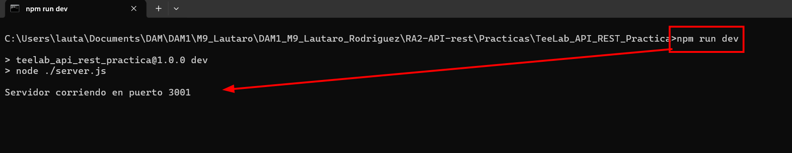
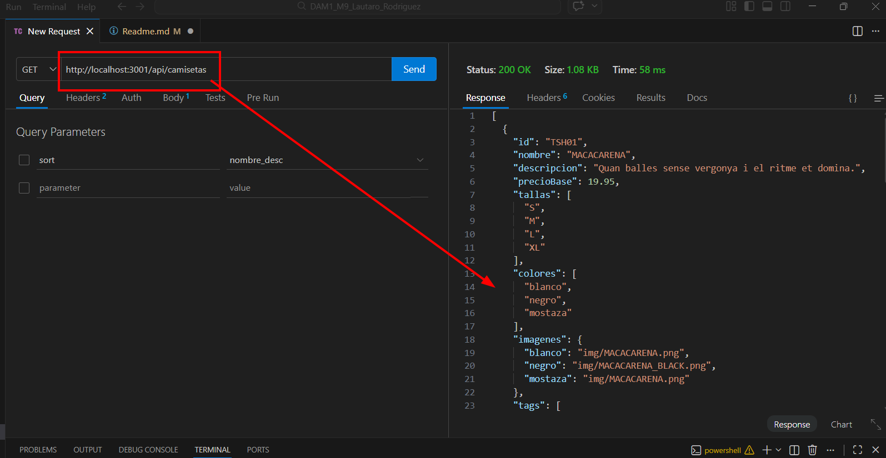
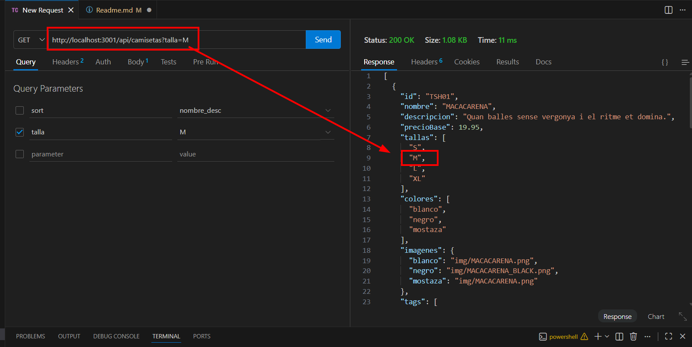
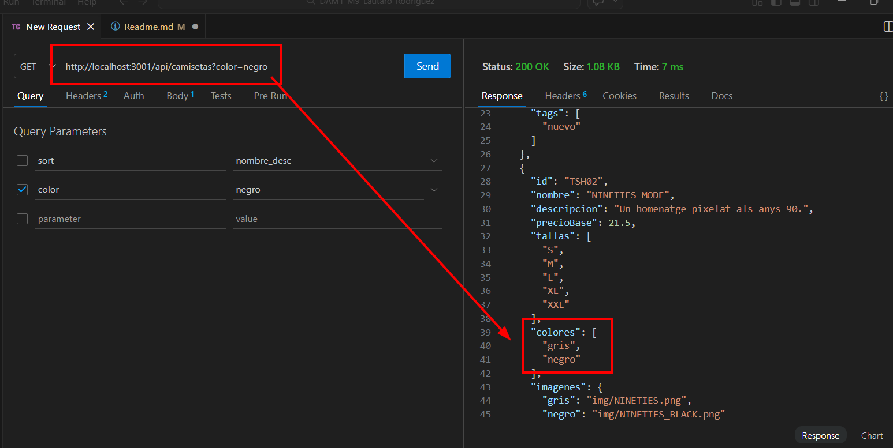

# Como arrancar
npm install
npm run dev

El servidor arranca en http://localhost:3001/

## Endpoints
### Camisetas

- GET /api/camisetas — lista todas las camisetas

- GET /api/camisetas?talla=M — filtra por talla

- GET /api/camisetas?color=negro — filtra por color

- GET /api/camisetas?tag=nuevo — filtra por tag

- GET /api/camisetas?q=palabra — busca en nombre o descripción

- GET /api/camisetas?sort=precio_asc — ordena por precio ascendente

- GET /api/camisetas?sort=precio_desc — ordena por precio descendente

- GET /api/camisetas?sort=nombre_asc — ordena por nombre ascendente

- GET /api/camisetas?sort=nombre_desc — ordena por nombre descendente

- GET /api/camisetas/:id — detalle de una camiseta

### Comandas
- POST /api/comandas — crear una comanda
- GET /api/comandas — listar todas las comandas
- GET /api/comandas/:id — detalle de una comanda